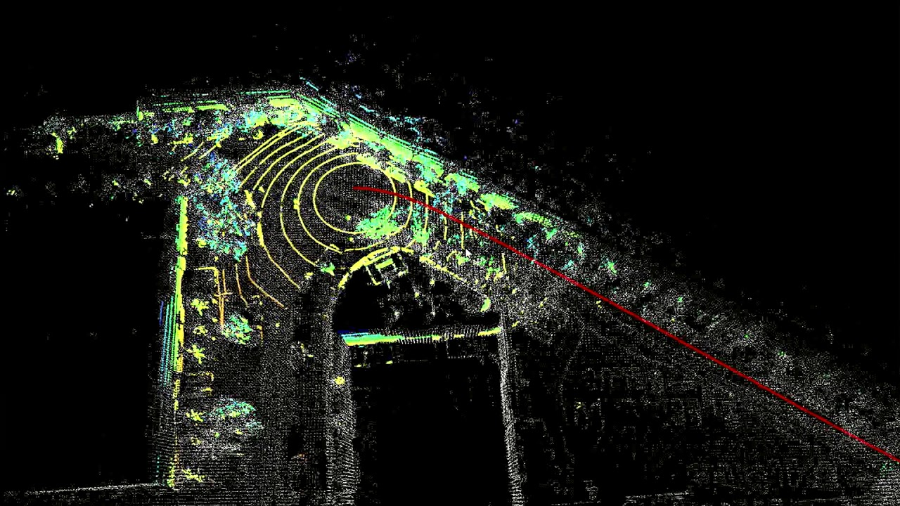
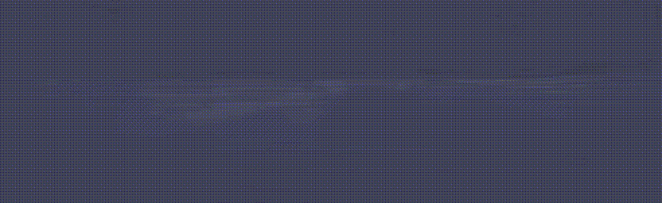
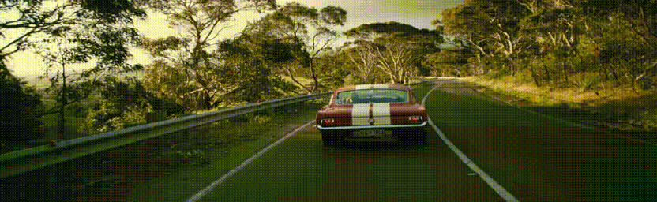

# SLAM Simultaneous localization & mapping  
- Tracks an agent's location in 3D space. 
- Uses a single camera to estimate for localization.
 

Execute
---
## Training
```sh
   python run.py
```
## Inferencing

```sh
   python run.py --test True
```
<table>
<tr>
<td></td>  
<td></td> 
<tr>
</table>

Directory 
--
    .
    ├── cpp                 # C++ Implementation
    ├── dataset             # Loads the dataset
    ├── etc                 # Junk files
    ├── extract             # Extracts Features
    ├── model_checkpoints   # Holds Models Files
    ├── networks            # Neural Networks
    ├── run.py              # Main Controller
    ├── support             # Helpers functions
    └── vision              # Manages 3D Visualization


Datasets
--
[Kitti (Depth)](http://www.cvlibs.net/datasets/kitti/eval_depth_all.php)

License
---
MIT


